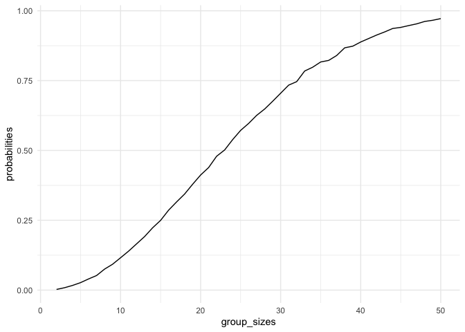
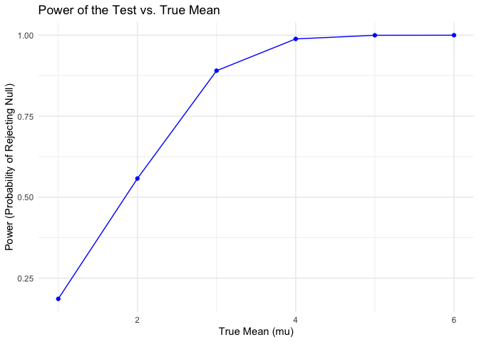
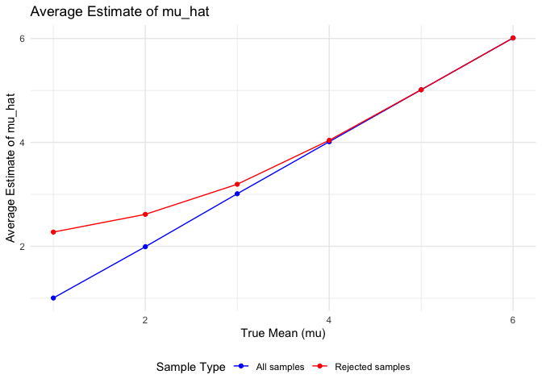

p8105_hw5_fl2715
================
Fengwei Lei

## Loading Library and Set Seed

``` r
library(tidyverse)

set.seed(1)

theme_set(theme_minimal() + theme(legend.position = "bottom"))
```

## Problem 1

Firstly, we define a function.

``` r
birthday_sim=function(n){
  birthdays=sample(1:365, size=n, replace=TRUE)
  duplicate=length(birthdays)!= length((unique(birthdays)))
  return(duplicate)
}
```

And then, we run this function 10000 times for each group size between 2
and 50. And we create a tibble for the result.

``` r
num_simulations = 10000
group_sizes = 2:50
probabilities = numeric(length(group_sizes))

for (i in seq_along(group_sizes)) {
  n = group_sizes[i]
  duplicate_count = sum(replicate(num_simulations, birthday_sim(n)))
  probabilities[i] = duplicate_count / num_simulations
}

result=tibble(group_sizes, probabilities)
```

Next, we make a plot showing the probability Vs the different group
sizes.

``` r
ggplot(aes(x=group_sizes, y=probabilities), data=result) +
  geom_line()
```

<!-- -->

**Comment**: From the above the plot, we can see that the probability
that at least two people share a birthday increases as the group size
increases. When the group size is 50, the probability of sharing
birthday is about 0.97, which is close to 1.

## Problem 2

We first contruct the function of the required normal model.

``` r
sim_norm=function(mu){
  n=30
  sigma=5
  sim_data=tibble(
    x=rnorm(n, mean=mu, sd=sigma)
  )
  
  mu_hat=sim_data$x
  p_value=t.test(sim_data$x, mu = 0) |> 
    broom::tidy() |> 
    pull(p.value)
  
  tibble(mu_hat=mu_hat, p_value=p_value)
}
```

Then, we generate 5000 datasets for the model.

``` r
sim_results_df = 
  expand_grid(
    mu =1:6,
    iter = 1:5000
  ) |> 
  mutate(
    estimate_df = map(mu, sim_norm)
  ) |> 
  unnest(estimate_df)
```

Next, we make a plot showing the proportion of times the null was
rejected (the power of the test) on the y axis and the true value of
$`\mu`$ on the x axis.

``` r
alpha=0.05
power_data = sim_results_df |> 
  group_by(mu)  |> 
  summarize(
    power = mean(p_value < alpha)
  )

# Plot the power as a function of the true mean (mu)
power_data |> 
  ggplot(aes(x = mu, y = power)) +
    geom_line(color = "blue") +
    geom_point(color = "blue") +
    labs(
      title = "Power of the Test vs. True Mean",
      x = "True Mean (mu)",
      y = "Power (Probability of Rejecting Null)"
    )
```

<!-- -->
Describe the association between **effect size and power**: From the
above plot, we can see that the power of the test increases as the true
mean increases from zero. It indicates a positive association between
effect size and power.

Finally, we make a plot for showing the average estimate of
($`\hat{\mu}`$) across each true mean for all sample cases and the null
rejected cases.

``` r
mu_estimates = sim_results_df  |> 
  group_by(mu)  |> 
  summarize(
    avg_mu_hat = mean(mu_hat),
    avg_mu_hat_rejected = mean(mu_hat[p_value < alpha])
  )

mu_estimates |> 
  ggplot(aes(x = mu)) +
    geom_line(aes(y = avg_mu_hat, color = "All samples")) +
    geom_line(aes(y = avg_mu_hat_rejected, color = "Rejected samples")) +
    geom_point(aes(y = avg_mu_hat, color = "All samples")) +
    geom_point(aes(y = avg_mu_hat_rejected, color = "Rejected samples")) +
    labs(
      title = "Average Estimate of mu_hat",
      x = "True Mean (mu)",
      y = "Average Estimate of mu_hat"
    ) +
    scale_color_manual(values = c("blue", "red"),
                       name = "Sample Type",
                       labels = c("All samples", "Rejected samples"))
```

<!-- -->

For the samples where the null was rejected, the average estimate of
($`\hat{\mu}`$) tends to be slightly higher than the true value when
true mean is equal to 1, 2, and 3. The average estimate of
($`\hat{\mu}`$) is approximately equal to the true mean when true mean
is equal to 4, 5, and 6. This is due to selection bias: tests are more
likely to reject when sample means are further from zero, creating an
upward bias in the average estimate when conditioning on rejection.
