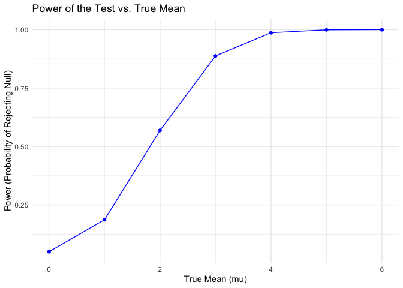
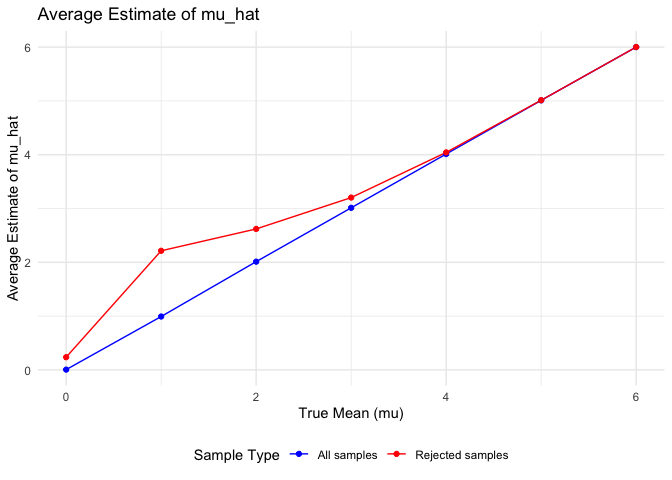

p8105_hw5_fl2715
================
Fengwei Lei

## Loading Library and Setting Seed

``` r
library(tidyverse)

set.seed(1)

theme_set(theme_minimal() + theme(legend.position = "bottom"))
```

## Problem 1

Firstly, we define a function.

``` r
birthday_sim=function(n){
  birthdays=sample(1:365, size=n, replace=TRUE)
  duplicate=length(birthdays)!= length((unique(birthdays)))
  return(duplicate)
}
```

And then, we run this function 10000 times for each group size between 2
and 50. And we create a tibble for the result.

``` r
num_simulations = 10000
group_sizes = 2:50
probabilities = numeric(length(group_sizes))

for (i in seq_along(group_sizes)) {
  n = group_sizes[i]
  duplicate_count = sum(replicate(num_simulations, birthday_sim(n)))
  probabilities[i] = duplicate_count / num_simulations
}

result=tibble(group_sizes, probabilities)
```

Next, we make a plot showing the probability Vs the different group
sizes.

``` r
ggplot(aes(x=group_sizes, y=probabilities), data=result) +
  geom_line()
```

<!-- -->

**Comment**: From the above the plot, we can see that the probability
that at least two people share a birthday increases as the group size
increases. When the group size is 50, the probability of sharing
birthday is about 0.97, which is close to 1.

## Problem 2

We first contruct the function of the required normal model.

``` r
sim_norm=function(mu){
  n=30
  sigma=5
  sim_data=tibble(
    x=rnorm(n, mean=mu, sd=sigma)
  )
  
  mu_hat=sim_data$x
  p_value=t.test(sim_data$x, mu = 0) |> 
    broom::tidy() |> 
    pull(p.value)
  
  tibble(mu_hat=mu_hat, p_value=p_value)
}
```

Then, we generate 5000 datasets for the model.

``` r
sim_results_df = 
  expand_grid(
    mu =0:6,
    iter = 1:5000
  ) |> 
  mutate(
    estimate_df = map(mu, sim_norm)
  ) |> 
  unnest(estimate_df)
```

Next, we make a plot showing the proportion of times the null was
rejected (the power of the test) on the y axis and the true value of
$`\mu`$ on the x axis.

``` r
alpha=0.05
power_data = sim_results_df |> 
  group_by(mu)  |> 
  summarize(
    power = mean(p_value < alpha)
  )

# Plot the power as a function of the true mean (mu)
power_data |> 
  ggplot(aes(x = mu, y = power)) +
    geom_line(color = "blue") +
    geom_point(color = "blue") +
    labs(
      title = "Power of the Test vs. True Mean",
      x = "True Mean (mu)",
      y = "Power (Probability of Rejecting Null)"
    )
```

<!-- -->

Describe the association between **effect size and power**: From the
above plot, we can see that the power of the test increases as the true
mean increases from zero. It indicates a positive association between
effect size and power.

Finally, we make a plot for showing the average estimate of
($`\hat{\mu}`$) across each true mean for all sample cases and the null
rejected cases.

``` r
mu_estimates = sim_results_df  |> 
  group_by(mu)  |> 
  summarize(
    avg_mu_hat = mean(mu_hat),
    avg_mu_hat_rejected = mean(mu_hat[p_value < alpha])
  )

mu_estimates |> 
  ggplot(aes(x = mu)) +
    geom_line(aes(y = avg_mu_hat, color = "All samples")) +
    geom_line(aes(y = avg_mu_hat_rejected, color = "Rejected samples")) +
    geom_point(aes(y = avg_mu_hat, color = "All samples")) +
    geom_point(aes(y = avg_mu_hat_rejected, color = "Rejected samples")) +
    labs(
      title = "Average Estimate of mu_hat",
      x = "True Mean (mu)",
      y = "Average Estimate of mu_hat"
    ) +
    scale_color_manual(values = c("blue", "red"),
                       name = "Sample Type",
                       labels = c("All samples", "Rejected samples"))
```

<!-- -->

For the samples where the null was rejected, the average estimate of
($`\hat{\mu}`$) tends to be slightly higher than the true value when
true mean is 0, 1, 2, and 3. The average estimate of ($`\hat{\mu}`$) is
equal to the true mean when true mean is 4, 5, and 6. This is due to
selection bias: tests are more likely to reject when sample means are
further from zero, creating an upward bias in the average estimate when
conditioning on rejection.

## Problem 3

First, we load the raw dataset. This dataset contains information on
homicides in 50 large U.S. cities. It includes 52179 observations and 12
variables. For each homicide observation, the data include details such
as the report date, location, victim characteristics, and case status.

``` r
homicide_data_raw = read_csv("data/homicide-data.csv") |>
  janitor::clean_names()
```

    ## Rows: 52179 Columns: 12
    ## ── Column specification ────────────────────────────────────────────────────────
    ## Delimiter: ","
    ## chr (9): uid, victim_last, victim_first, victim_race, victim_age, victim_sex...
    ## dbl (3): reported_date, lat, lon
    ## 
    ## ℹ Use `spec()` to retrieve the full column specification for this data.
    ## ℹ Specify the column types or set `show_col_types = FALSE` to quiet this message.

``` r
head(homicide_data_raw)
```

    ## # A tibble: 6 × 12
    ##   uid   reported_date victim_last victim_first victim_race victim_age victim_sex
    ##   <chr>         <dbl> <chr>       <chr>        <chr>       <chr>      <chr>     
    ## 1 Alb-…      20100504 GARCIA      JUAN         Hispanic    78         Male      
    ## 2 Alb-…      20100216 MONTOYA     CAMERON      Hispanic    17         Male      
    ## 3 Alb-…      20100601 SATTERFIELD VIVIANA      White       15         Female    
    ## 4 Alb-…      20100101 MENDIOLA    CARLOS       Hispanic    32         Male      
    ## 5 Alb-…      20100102 MULA        VIVIAN       White       72         Female    
    ## 6 Alb-…      20100126 BOOK        GERALDINE    White       91         Female    
    ## # ℹ 5 more variables: city <chr>, state <chr>, lat <dbl>, lon <dbl>,
    ## #   disposition <chr>

Then, we create the `city_state` variable. And we summarize within
cities to obtain the total number of homicides and the number of
unsolved homicides (those for which the disposition is “Closed without
arrest” or “Open/No arrest”).

``` r
homicide_data =homicide_data_raw |> 
  mutate(
    city_state = paste(city, state, sep = ", "),
    unsolved = disposition %in% c("Closed without arrest", "Open/No arrest")
  )  

homicide_city = homicide_data |> 
  group_by(city)  |> 
  summarise(
    total_homicides = n(),
    unsolved_homicides = sum(unsolved)
  )

knitr::kable(homicide_city)
```

| city           | total_homicides | unsolved_homicides |
|:---------------|----------------:|-------------------:|
| Albuquerque    |             378 |                146 |
| Atlanta        |             973 |                373 |
| Baltimore      |            2827 |               1825 |
| Baton Rouge    |             424 |                196 |
| Birmingham     |             800 |                347 |
| Boston         |             614 |                310 |
| Buffalo        |             521 |                319 |
| Charlotte      |             687 |                206 |
| Chicago        |            5535 |               4073 |
| Cincinnati     |             694 |                309 |
| Columbus       |            1084 |                575 |
| Dallas         |            1567 |                754 |
| Denver         |             312 |                169 |
| Detroit        |            2519 |               1482 |
| Durham         |             276 |                101 |
| Fort Worth     |             549 |                255 |
| Fresno         |             487 |                169 |
| Houston        |            2942 |               1493 |
| Indianapolis   |            1322 |                594 |
| Jacksonville   |            1168 |                597 |
| Kansas City    |            1190 |                486 |
| Las Vegas      |            1381 |                572 |
| Long Beach     |             378 |                156 |
| Los Angeles    |            2257 |               1106 |
| Louisville     |             576 |                261 |
| Memphis        |            1514 |                483 |
| Miami          |             744 |                450 |
| Milwaukee      |            1115 |                403 |
| Minneapolis    |             366 |                187 |
| Nashville      |             767 |                278 |
| New Orleans    |            1434 |                930 |
| New York       |             627 |                243 |
| Oakland        |             947 |                508 |
| Oklahoma City  |             672 |                326 |
| Omaha          |             409 |                169 |
| Philadelphia   |            3037 |               1360 |
| Phoenix        |             914 |                504 |
| Pittsburgh     |             631 |                337 |
| Richmond       |             429 |                113 |
| Sacramento     |             376 |                139 |
| San Antonio    |             833 |                357 |
| San Bernardino |             275 |                170 |
| San Diego      |             461 |                175 |
| San Francisco  |             663 |                336 |
| Savannah       |             246 |                115 |
| St. Louis      |            1677 |                905 |
| Stockton       |             444 |                266 |
| Tampa          |             208 |                 95 |
| Tulsa          |             584 |                193 |
| Washington     |            1345 |                589 |

Next, for Baltimore, MD, we’ll use the `prop.test` function to estimate
the proportion of unsolved homicides. We will tidy the results with
`broom::tidy` to extract the estimated proportion and confidence
intervals.

``` r
baltimore_summary = homicide_data |> 
  filter(city_state == "Baltimore, MD") |> 
  summarize(
    unsolved_homicides = sum(unsolved),
    total_homicides = n()
  ) 

baltimore_test= prop.test(
  baltimore_summary$unsolved_homicides,
  baltimore_summary$total_homicides
)

baltimore_results = broom::tidy(baltimore_test)  |> 
  select(estimate, conf.low, conf.high)

knitr::kable(baltimore_results, caption="Proportion Test Results for Baltimore, MD")
```

|  estimate |  conf.low | conf.high |
|----------:|----------:|----------:|
| 0.6455607 | 0.6275625 | 0.6631599 |

Proportion Test Results for Baltimore, MD

Next, we will perform a `prop.test` for each city to estimate the
proportion of unsolved homicides and extract confidence intervals. We’ll
use a tidy pipeline with `purrr::map2` to apply `prop.test` across all
cities.

``` r
city_test_results = homicide_city |> 
  mutate(
    test_results =  map2(unsolved_homicides, total_homicides, \(x, y) broom::tidy(prop.test(x, y)))
  )  |> 
  unnest(test_results)  |> 
  select(city, estimate, conf.low, conf.high)

knitr::kable(city_test_results, caption="Proportion Test Results across Each City")
```

| city           |  estimate |  conf.low | conf.high |
|:---------------|----------:|----------:|----------:|
| Albuquerque    | 0.3862434 | 0.3372604 | 0.4375766 |
| Atlanta        | 0.3833505 | 0.3528119 | 0.4148219 |
| Baltimore      | 0.6455607 | 0.6275625 | 0.6631599 |
| Baton Rouge    | 0.4622642 | 0.4141987 | 0.5110240 |
| Birmingham     | 0.4337500 | 0.3991889 | 0.4689557 |
| Boston         | 0.5048860 | 0.4646219 | 0.5450881 |
| Buffalo        | 0.6122841 | 0.5687990 | 0.6540879 |
| Charlotte      | 0.2998544 | 0.2660820 | 0.3358999 |
| Chicago        | 0.7358627 | 0.7239959 | 0.7473998 |
| Cincinnati     | 0.4452450 | 0.4079606 | 0.4831439 |
| Columbus       | 0.5304428 | 0.5002167 | 0.5604506 |
| Dallas         | 0.4811742 | 0.4561942 | 0.5062475 |
| Denver         | 0.5416667 | 0.4846098 | 0.5976807 |
| Detroit        | 0.5883287 | 0.5687903 | 0.6075953 |
| Durham         | 0.3659420 | 0.3095874 | 0.4260936 |
| Fort Worth     | 0.4644809 | 0.4222542 | 0.5072119 |
| Fresno         | 0.3470226 | 0.3051013 | 0.3913963 |
| Houston        | 0.5074779 | 0.4892447 | 0.5256914 |
| Indianapolis   | 0.4493192 | 0.4223156 | 0.4766207 |
| Jacksonville   | 0.5111301 | 0.4820460 | 0.5401402 |
| Kansas City    | 0.4084034 | 0.3803996 | 0.4370054 |
| Las Vegas      | 0.4141926 | 0.3881284 | 0.4407395 |
| Long Beach     | 0.4126984 | 0.3629026 | 0.4642973 |
| Los Angeles    | 0.4900310 | 0.4692208 | 0.5108754 |
| Louisville     | 0.4531250 | 0.4120609 | 0.4948235 |
| Memphis        | 0.3190225 | 0.2957047 | 0.3432691 |
| Miami          | 0.6048387 | 0.5685783 | 0.6400015 |
| Milwaukee      | 0.3614350 | 0.3333172 | 0.3905194 |
| Minneapolis    | 0.5109290 | 0.4585150 | 0.5631099 |
| Nashville      | 0.3624511 | 0.3285592 | 0.3977401 |
| New Orleans    | 0.6485356 | 0.6231048 | 0.6731615 |
| New York       | 0.3875598 | 0.3494421 | 0.4270755 |
| Oakland        | 0.5364308 | 0.5040588 | 0.5685037 |
| Oklahoma City  | 0.4851190 | 0.4467861 | 0.5236245 |
| Omaha          | 0.4132029 | 0.3653146 | 0.4627477 |
| Philadelphia   | 0.4478103 | 0.4300380 | 0.4657157 |
| Phoenix        | 0.5514223 | 0.5184825 | 0.5839244 |
| Pittsburgh     | 0.5340729 | 0.4942706 | 0.5734545 |
| Richmond       | 0.2634033 | 0.2228571 | 0.3082658 |
| Sacramento     | 0.3696809 | 0.3211559 | 0.4209131 |
| San Antonio    | 0.4285714 | 0.3947772 | 0.4630331 |
| San Bernardino | 0.6181818 | 0.5576628 | 0.6753422 |
| San Diego      | 0.3796095 | 0.3354259 | 0.4258315 |
| San Francisco  | 0.5067873 | 0.4680516 | 0.5454433 |
| Savannah       | 0.4674797 | 0.4041252 | 0.5318665 |
| St. Louis      | 0.5396541 | 0.5154369 | 0.5636879 |
| Stockton       | 0.5990991 | 0.5517145 | 0.6447418 |
| Tampa          | 0.4567308 | 0.3881009 | 0.5269851 |
| Tulsa          | 0.3304795 | 0.2927201 | 0.3705039 |
| Washington     | 0.4379182 | 0.4112495 | 0.4649455 |

Proportion Test Results across Each City

Finally, we will create a plot that shows the estimated proportion of
unsolved homicides for each city, along with their confidence intervals.

``` r
city_test_results = city_test_results  |> 
  arrange(desc(estimate))  |> 
  mutate(city = factor(city, levels = city))

city_test_results |> 
ggplot(aes(x = city, y = estimate)) +
  geom_point(color = "red") +
  geom_errorbar(aes(ymin = conf.low, ymax = conf.high), width = 0.25) +
  coord_flip() +
  labs(
    title = "Proportion of Unsolved Homicides by City",
    x = "City",
    y = "Proportion of Unsolved Homicides (with 95% CI)"
  )
```

<!-- -->
